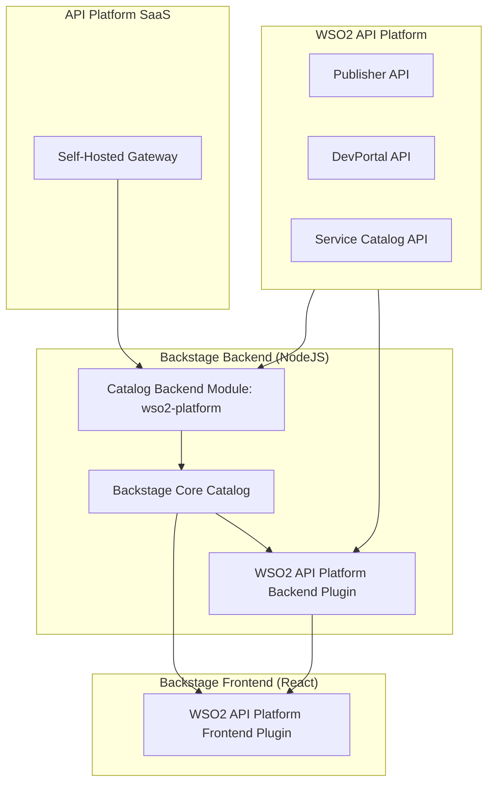
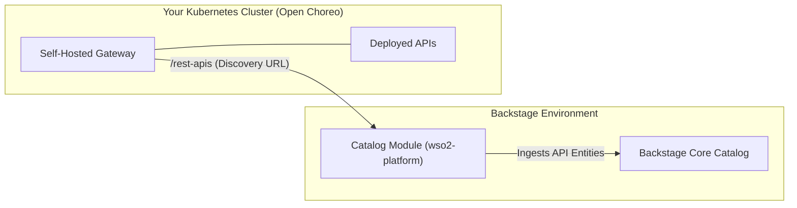

# WSO2 API Manager Backstage Plugins

This repository contains Backstage plugins for integrating with **WSO2 API Manager**. It automatically synchronizes your WSO2 API Platform content directly into the Backstage Software Catalog, discovering your WSO2 APIs, API products, MCP servers, and Services on a customizable schedule to provide a unified portal for API discovery and invocation.

## Documentation

For a comprehensive guide on installing, configuring, and using these plugins, please refer to the official documentation:

- [WSO2 API Manager Documentation](https://apim.docs.wso2.com)

### Plugin API Specifications (OpenAPI)

Curious about how these plugins interact with your WSO2 instance? The [api-docs](./api-docs) folder contains the exact OpenAPI specifications and interactive documentation for all the WSO2 API Manager endpoints that these plugins rely on under the hood.

## Plugin Packages

This integration suite consists of three interconnected packages. You can find specific details and schemas for each package in their respective README files:

| Package                                                       | Description                                                                                                                                                  | README                                                                  |
| ------------------------------------------------------------- | ------------------------------------------------------------------------------------------------------------------------------------------------------------ | ----------------------------------------------------------------------- |
| `@rithakith/backstage-plugin-wso2-api-platform`                    | **Frontend Plugin:** Provides the main WSO2 API Platform page, Entity Pages, API Try-Out consoles, and UI components.                                        | [View README](./plugins/wso2-api-platform/README.md)                    |
| `@rithakith/backstage-plugin-wso2-api-platform-backend`            | **Backend Plugin:** Handles secure API proxying, credentials generation, and runtime operations.                                                             | [View README](./plugins/wso2-api-platform-backend/README.md)            |
| `@rithakith/backstage-plugin-catalog-backend-module-wso2-api-platform` | **Catalog Module:** Responsible for the automatic discovery and ingestion of WSO2 APIs, API Products, MCP Servers, and Services into your Backstage Catalog. | [View README](./plugins/catalog-backend-module-wso2-api-platform/README.md) |

## Architecture

The following diagram illustrates how the three plugin packages interact with your WSO2 API Platform and Backstage environment:

### How they connect:

1. **Catalog Module (`catalog-backend-module-wso2-platform`)**: Periodically polls your WSO2 API Platform (and Self-Hosted Gateways) to discover APIs, API Products, MCP Servers, and Services. It ingests this data into the **Backstage Core Catalog**.
2. **Frontend Plugin (`wso2-api-platform`)**: Reads the ingested data from the Core Catalog to render the global API Platform discovery page and the specific Entity tabs. It also sends requests to the Backend Plugin for secure operations (like generating API keys or testing APIs).
3. **Backend Plugin (`wso2-api-platform-backend`)**: Acts as a secure bridge between the frontend UI and WSO2. It handles sensitive operations such as API Key generation, token management, and proxying requests to the WSO2 APIs (Publisher, DevPortal, and Service Catalog APIs).

## Self-Hosted Gateway Integration (Open Choreo)

If you are deploying self-hosted gateways using the [WSO2 API Platform Gateway Operator](https://openchoreo.dev/ecosystem/item/?id=wso2-api-platform-gateway) in your Kubernetes clusters, you can easily discover and display all APIs deployed on them directly within Backstage.

By adding your gateway discovery URLs to the `wso2ApiPlatformGateway` configuration in your `app-config.yaml`, the catalog module will periodically poll the gateway's REST APIs (such as the `config_dump` endpoints) and synchronize your data plane APIs straight into the Backstage Software Catalog.

## License

This project is licensed under the Apache License, Version 2.0.
